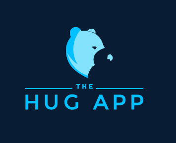

# HUG Lite App – Streamlit Mockup

This is a lightweight prototype of **The Hug App**, built using Streamlit. It simulates workflows like care job posting, trusted network selection, and transport tracking.



## 🚀 Features

- ✅ Post care jobs with title, type, location, and time
- ✅ Select trusted carers from your network
- ✅ Simulated transport map view
- ✅ Custom branding with Hug App colors and logo
- ✅ Fully deployable on Streamlit Cloud

## 🛠 Tech Stack

- Python
- Streamlit
- JSON (for mock data)
- GitHub (for version control)
- Streamlit Cloud (for hosting)

---

## 📦 Setup Instructions

1. **Clone the repo**:
   ```bash
   git clone https://github.com/yourusername/hug-lite.git
   cd hug-lite

2. **Install requirements**:
    pip install streamlit

3. **Run the app**:
    streamlit run app.py

4. **Deploy to Streamlit Cloud**:
    -Push the repo to GitHub
    -Go to https://streamlit.io/cloud
    -Link your GitHub repo and deploy 🚀

---

## 🙌 Credits
Inspired by The Hug App vision. Not affiliated with the original IP holders.
